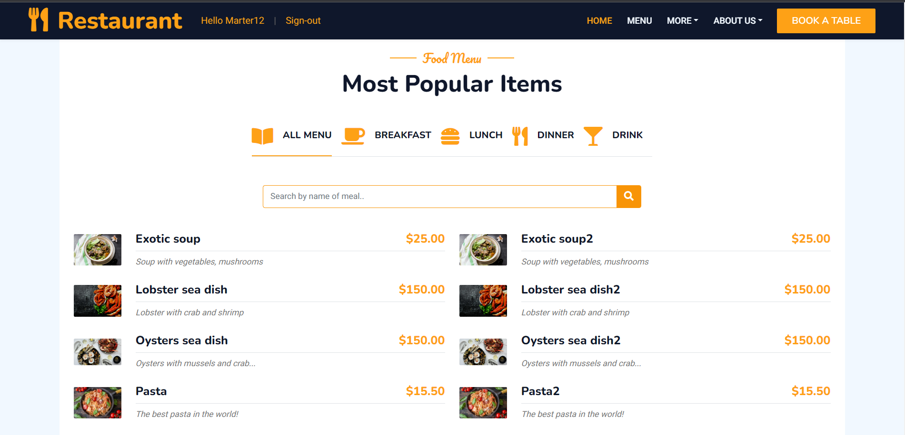

# Pet-project-restaurant

Django project for watching menu, tables reservation, and managing info for admin.

## Check it out!
[Pet-project-restaurant deployed to Render](path to page)

### Installation

Python3 must be already installed

```shell
git clone https://github.com/YehorKorn/pet-project-restaurant.git
cd pet-project-restaurant.git
python3 -m venv venv
source venv/bin/activate
pip install -r requirements.txt
python manage.py runserver
```

- Next activate your venv 
  - `venv\Scripts\activate` (on Windows)
  - `source venv/bin/activate` (on macOS)

For initial db use this command `python manage.py migrate`

For will download fixture (fill databases information) run this `python manage.py loaddata pet_project_restaurant_db_data.json`

## Features

* Authentication functional for User/Admin
* Watching menu & detail info about meal & information about restaurant and personal
* Reservation tables
* For admin check list table reservation & edit/delete meals

### Authentication data to log in to the site
1. For Sign-in by admin use:
    - login: `AdminUser`
    - password: `1qazcde3`

2. For Sign-in by other user use:
    - login: `Marter12`
    - password: `1qazcde3`

## Demo


